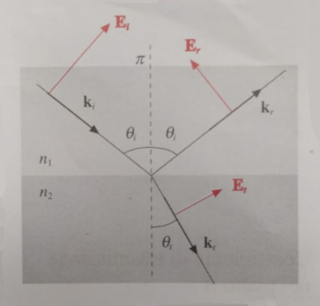
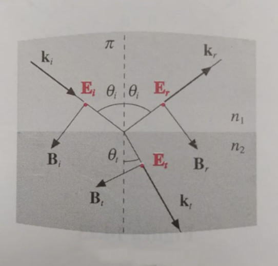

# Data
This folder contains all the data we took during our lab session.
- The data in the [pi](https://github.com/P2-718na/fresnel-coefficients-experiment/tree/master/data/pi)
  folder was recorded with the laser beam polarised _parallel to the
  plane of incidence_.
- The data in the [sigma](https://github.com/P2-718na/fresnel-coefficients-experiment/tree/master/data/sigma)
  folder was recorded with the laser beam polarised _perpendicular to the plane of incidence_.

For a quick reference, look at these images [_Mazzoldi_, 1998] :

|            pi polarisation            |             sigma polarisation              |
|:-------------------------------------:|:-------------------------------------------:|
|  |  |

## Datasets
### pi
- [sim.csv](pi/sim.csv): simulated data generated using _ROOT_. Parameters: `n1 = 1`, `n2 = 1.509`, `I_0 = 950`.
- [run1.csv](pi/run1.csv): first test run with lab equipment. Data logged with _Python_. Parameters: `step = 5°`.
- [run2.csv](pi/run2.csv): second test run with lab equipment. Data logged with _Python_. Parameters: `step = 5°`.
- [run3.csv](pi/run3.csv): third run with lab equipment. Data logged with _Python_. Parameters: `step = 2°`.
- [run3-manual.csv](pi/run3-manual.csv): third run with lab equipment. Data logged by hand. Parameters: `step = 2°`.

### sigma
- [sim.csv](sigma/sim.csv): simulated data with parameters: `n1 = 1`, `n2 = 1.509`, `I_0 = 950`.
- [run1.csv](sigma/run1-manual.csv): first run with lab equipment. Data logged with _Python_. Parameters: `step = 2°`.
- [run3-manual.csv](pisigma/run1-manual.csv): third run with lab equipment. Data logged by hand. Parameters: `step = 2°`.
